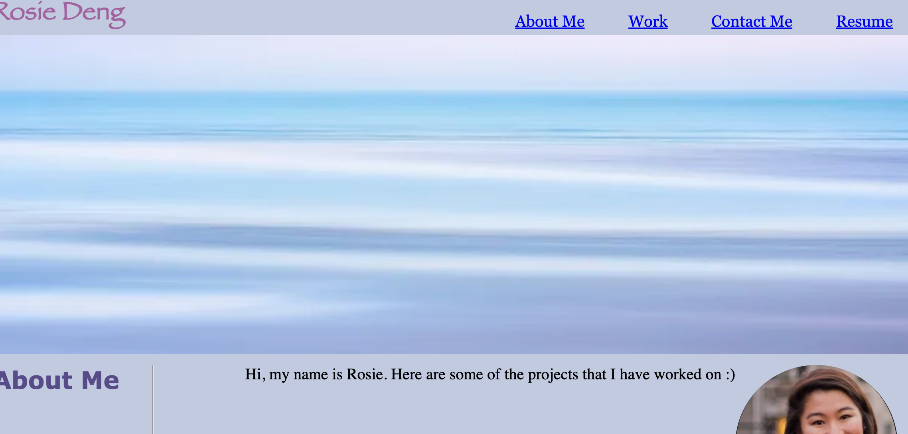
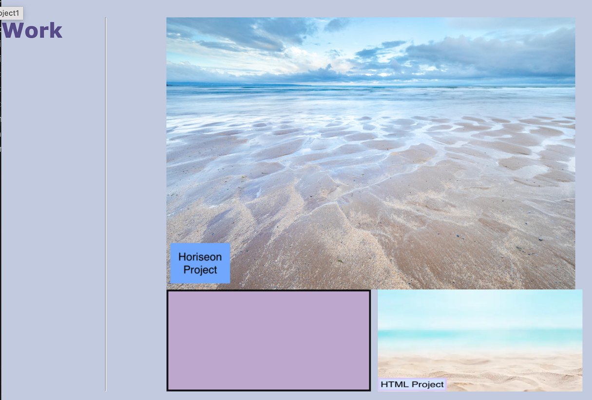

Portfolio Week 2 
## Description

The purpose of this project was to create my own portfolio that gives details about myself and projects I've worked on so potential employers/anyone can look at. I built this project to have a website that showcases my skills and give people access to my contact info if they would like to reach out/are interested. It solves the problem of creating a space to showcase my work. I learned a lot about how to create a website from scratch which includes using flexboxes, media queries, and structuring a website properly. 

## Usage

This website can be used by clicking on one of the links at the top right (About Me, Work, Contact Me, etc) which will go to the corresponding section and gives details on that topic that is linked. In the Work section, if you click on an image, it will link to a corresponding project that I have worked on. If you resize the webpage, you can see that there is a responsive layout where the content adjusts to webpage. 

Link to live site:
https://rosiedeng1.github.io/ClassAssignmentWeek2/

Instructions for ![Website]: This shows the website format where if you click on one of the links on the right site, it will go to the corresponding section 
Instructions for ![Projects]: If you click on one the images in the projects section, it will take you to the deployed application
Instructions for ![WebsiteWithResponsiveLayout]: This shows the has a responsive layout where if you minimize the webpage, the layout will adapt to the viewport
## Credits 

Flexbox Tutorial: https://css-tricks.com/snippets/css/a-guide-to-flexbox/

## License

Please refer to the LICENSE in the repo.

